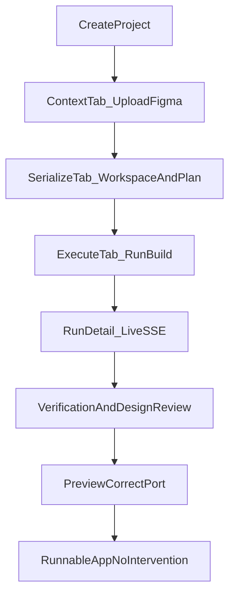

# Midnight Agent Space — Full Stabilization & UX Plan

## Goal

A user can open the dashboard, create/select a project, upload context (Figma/docs), serialize once, click **Execute**, and receive a **locally runnable app** (correct preview port, worktree code, verification pass) with **no hidden failures** and a **clean, full-width UI**.

---

## Recurring issues (high priority — from prior sessions)

These are treated as **P0 blockers** because they appeared repeatedly:

| Issue | Root cause (known) | Key files |
|-------|-------------------|-----------|
| Run stuck `RUNNING` / tasks wrong | Exception during `_update_run`, orphaned asyncio tasks on API restart | `dashboard/backend/services/run_service.py` |
| UI shows stale `FAILED` | `boardRun` pinned to terminal run; polling stopped when no active run | `dashboard/frontend/src/pages/ProjectDetail.tsx` |
| Cursor Agent run crashes | Prompt sent via stdin (`-`); `BrokenPipeError` | `dashboard/backend/services/cursor_agent_runner.py` |
| Preview on wrong port / fails | Port 5173 = MAS dashboard; Windows `Popen` preview spawn | `preview_detection_service.py`, `projects.py` |
| API / UI hangs | DB `localhost` → IPv6; pool exhaustion; hung Vite/API | `config.py`, `database.py` |
| Document download 500 | Unicode filenames in `Content-Disposition` | `routes/documents.py` |
| Analysis sent to reviewer | `analysis` in `REVIEW_TASK_TYPES` | `agent_routing_service.py` |
| Refresh / blank page | Missing route after deploy; `boardTasks` ReferenceError; blind polling | `ProjectDetail.tsx`, `projects.py` |
| Design mismatch | No enforced post-run visual review | `review_check_service.py`, `executor_prompt.md` — see [figma-fidelity-pipeline.md](./figma-fidelity-pipeline.md) |
| Hidden failures | `.catch(() => {})` on polls; cancel/retry without error UI | `ProjectDetail.tsx`, `RunDetail.tsx`, `useRunMonitor.ts` |

---

## Target end-to-end flow

---

## Phase 1 — Execution pipeline reliability (P0)

- Persist-safe execution payloads via `_sanitize_cli_task_result`
- Orphan run recovery on API startup
- `TASK_STARTED` events for per-task execution
- Cursor Agent argv prompt delivery + long-prompt file fallback
- Balanced routing: code tasks → Cursor Agent; review → reviewer CLI
- Worktree-aware preview search roots

## Phase 2 — Preview & runnable output (P0)

- Windows preview spawn with detached process + PID persistence
- Ports 5180+ (never 5173/8001)
- Post-run verification: package.json, dev script, preview HTTP

## Phase 3 — Failure visibility (P0)

- `StatusBanner` component for API/SSE/poll failures
- Structured API errors `{ detail, code, hint }`
- `GET /api/projects/{id}/health` aggregation endpoint

## Phase 4 — UI/UX overhaul (P1)

- Full-width layout (`max-w-[1600px]`)
- URL-synced project tabs `/projects/:id/:tab`
- Settings via `/settings` route
- Smarter polling (tab-aware, SSE-first)

## Phase 5 — Automated test suite (P1)

- Backend: `dashboard/backend/tests/` (pytest)
- Frontend: vitest for `runMonitor`, `api`, board run logic
- CI: GitHub Actions

## Phase 6 — Cleanup (P2)

- Remove orphan components
- Batch project summaries (fix N+1)
- Document single API surface

---

## Feature verification matrix

| Feature | API / path | Test |
|---------|------------|------|
| Health | `GET /health` | pytest smoke |
| Create project | `POST /api/projects` | vitest + e2e |
| Upload document | `POST .../documents/upload` | pytest |
| Document file download | `GET .../documents/{id}/file` | pytest unicode |
| Workspace prepare | `POST .../workspace/prepare` | e2e |
| Codebase serialize | `POST .../codebase/serialize` | e2e |
| Analysis plan | `POST .../analysis-plan` | e2e |
| Quick run execute | `POST .../quick-runs` | integration |
| Run SSE | `GET .../events/stream` | vitest |
| Cancel / retry / reconcile / cleanup | POST endpoints | pytest |
| Project refresh | `POST .../refresh` | pytest |
| Preview detect/start/status | preview routes | pytest |
| Runtime check | `GET /api/agentic/runtime/check` | script |
| Project health | `GET /api/projects/{id}/health` | pytest |
| URL tabs | `/projects/:id/execute` | vitest |

---

## Success criteria

1. **MorningGlory-Final (project 5)** completes full run: 4 tasks, worktree has frontend code, preview on `127.0.0.1:518x` returns HTTP 200.
2. No run remains `RUNNING` after API restart without explicit in-progress agent.
3. Every failure shows in UI within 5s (banner, run event, or task swimlane).
4. Hard refresh never required to clear stale failed state.
5. `pytest dashboard/backend/tests` and `npm run test` pass in CI.
6. Project pages use full screen width; tabs are URL-addressable.

---

## Implementation order

1. P0 backend reliability (run lifecycle, cursor runner tests, orphan recovery)
2. P0 failure visibility (StatusBanner, silent catch removal)
3. P0 preview Windows fix + worktree detection
4. P1 UI layout + URL tabs + settings separation
5. P1 pytest + vitest + CI
6. P2 API consolidation + docs update
7. Live MorningGlory validation run
