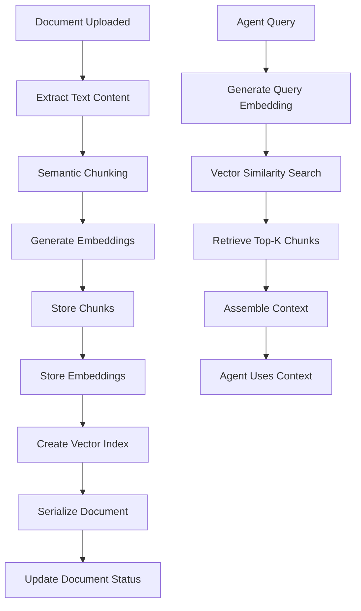

# Complete RAG Workflow Guide

## End-to-End RAG Pipeline

This guide explains how all RAG components work together in the document serialization workflow.

## Complete Flow Diagram



## Workflow Integration

### Where RAG Fits in Temporal Workflow

The RAG pipeline is integrated into the `DocumentSerializationWorkflow`:

1. **Document Retrieval**: Get documents from database
2. **Chunking Activity**: Split documents semantically
3. **Embedding Activity**: Generate vector embeddings
4. **Storage Activity**: Store chunks and vectors
5. **Serialization Activity**: Serialize document (uses stored vectors)
6. **Update Activity**: Mark document as processed

### Activity Dependencies

```python
# Sequential dependencies
documents = await get_project_documents_activity(project_id)
for document in documents:
    chunks = await chunk_document_activity(document)  # Depends on document
    chunks_with_embeddings = await generate_embeddings_activity(chunks)  # Depends on chunks
    chunk_ids = await store_vectors_activity(chunks_with_embeddings)  # Depends on embeddings
    # ... serialization continues
```

## Use Cases

### 1. Agent Context for Task Creation

When creating tasks, agents retrieve relevant context:

```python
# In task creation workflow
task_description = "Implement user authentication"

# Retrieve relevant chunks
relevant_chunks = search_similar_chunks(
    query_text=task_description,
    project_id=project_id,
    limit=5
)

# Build context for agent
context = {
    "task": task_description,
    "relevant_documents": [
        {
            "document_id": chunk["document_id"],
            "content": chunk["chunk_text"],
            "relevance_score": 1 - chunk["distance"]  # Convert distance to similarity
        }
        for chunk in relevant_chunks
    ]
}

# Agent uses context to create detailed task
```

### 2. Requirement Analysis

BRA (Business Requirements Analyst) agent uses RAG:

```python
# Agent needs to understand project requirements
requirements_query = "What are the authentication requirements?"

requirements_chunks = search_similar_chunks(
    query_text=requirements_query,
    project_id=project_id,
    document_type="requirements",
    limit=10
)

# Analyze and structure requirements
structured_requirements = agent.analyze(requirements_chunks)
```

### 3. Development Context

Task Executor agent retrieves code examples:

```python
# Developer agent needs implementation examples
code_query = "How to implement REST API endpoints?"

code_chunks = search_similar_chunks(
    query_text=code_query,
    project_id=project_id,
    document_type="code",
    limit=5
)

# Use code examples as reference
implementation_plan = agent.plan_with_examples(code_chunks)
```

## Step-by-Step: Complete RAG Process

### Phase 1: Document Ingestion

**When**: Document is uploaded to system

```python
# Document stored in project_document table
document = {
    "document_id": 45,
    "project_id": 1,
    "raw_text_content": "Full document text...",
    "document_type": "requirements"
}
```

### Phase 2: Chunking

**Activity**: `chunk_document_activity`

```python
chunks = await chunk_document_activity(document)
# Result: List of chunks with metadata
```

**What Happens**:
- Text extracted from document
- Split into semantic chunks (1000 chars, 200 overlap)
- Metadata generated (position, tokens, index)

### Phase 3: Embedding Generation

**Activity**: `generate_embeddings_activity`

```python
chunks_with_embeddings = await generate_embeddings_activity(chunks)
# Result: Chunks with embedding vectors added
```

**What Happens**:
- Chunks batched for efficiency
- OpenAI API called for embeddings
- 1536-dimensional vectors generated
- Retry logic handles rate limits

### Phase 4: Vector Storage

**Activity**: `store_vectors_activity`

```python
chunk_ids = await store_vectors_activity(chunks_with_embeddings)
# Result: List of chunk_ids from database
```

**What Happens**:
- Chunks inserted into `document_chunk` table
- Embeddings inserted into `document_embedding` table
- Vector index used for fast queries
- Transaction ensures data consistency

### Phase 5: Query Preparation

**When**: Agent needs context

```python
# Agent has a question or needs context
query = "What are the authentication requirements?"
```

### Phase 6: Similarity Search

**Function**: `search_similar_chunks`

```python
relevant_chunks = search_similar_chunks(
    query_text=query,
    project_id=1,
    limit=5,
    distance_metric="cosine"
)
```

**What Happens**:
- Query text converted to embedding
- Vector similarity search executed
- Top-K most similar chunks retrieved
- Results ranked by similarity

### Phase 7: Context Assembly

**Final Step**: Build context for agent

```python
# Assemble retrieved chunks into context
context_parts = []
for chunk in relevant_chunks:
    context_parts.append({
        "source": f"Document {chunk['document_id']}",
        "content": chunk["chunk_text"],
        "relevance": 1 - chunk["distance"]
    })

agent_context = {
    "query": query,
    "relevant_sections": context_parts,
    "total_chunks": len(context_parts)
}
```

## Workflow Code Example

### Complete Workflow Execution

```python
from workflows.document_serialization_workflow import DocumentSerializationWorkflow
from client import start_document_serialization

# Start workflow
workflow_id = await start_document_serialization(
    agent_id=2,
    project_id=1,
    use_cursor_api=True
)

# Workflow automatically:
# 1. Gets documents
# 2. Chunks each document
# 3. Generates embeddings
# 4. Stores vectors
# 5. Serializes documents
# 6. Updates database
```

### Retrieval During Task Creation

```python
# In a separate workflow/activity
from utils.vector_utils import search_similar_chunks

def get_task_context(task_description: str, project_id: int):
    """Retrieve relevant context for a task."""
    chunks = search_similar_chunks(
        query_text=task_description,
        project_id=project_id,
        limit=5
    )
    
    return {
        "task": task_description,
        "context": [chunk["chunk_text"] for chunk in chunks],
        "sources": [chunk["document_id"] for chunk in chunks]
    }
```

## Error Propagation

Errors in RAG pipeline are handled at each step:

1. **Chunking Errors**: Empty documents, encoding issues → Log and skip
2. **Embedding Errors**: Rate limits, API failures → Retry with backoff
3. **Storage Errors**: Database issues → Rollback transaction
4. **Search Errors**: Missing embeddings → Return empty results

## Performance Considerations

### Chunking Performance

- **Time**: ~1-5ms per document (depends on size)
- **Memory**: Minimal (streaming processing)
- **Bottleneck**: Text processing

### Embedding Performance

- **Time**: ~100-500ms per batch (API latency)
- **Memory**: Low (embeddings are small)
- **Bottleneck**: OpenAI API rate limits

### Storage Performance

- **Time**: ~10-50ms per chunk (database insert)
- **Memory**: Low
- **Bottleneck**: Database I/O

### Search Performance

- **Time**: ~5-50ms per query (with index)
- **Memory**: Low
- **Bottleneck**: Index quality

## Monitoring

### Key Metrics

- **Chunks Created**: Total chunks across all documents
- **Embeddings Generated**: Success rate, API calls
- **Storage Size**: Table sizes, index sizes
- **Search Performance**: Query times, result quality

### Logging

All activities log:
- Start/end times
- Success/failure
- Error details
- Performance metrics

## Next Steps

- Review [Troubleshooting Guide](06_TROUBLESHOOTING.md) for common issues
- See [Examples](07_EXAMPLES.md) for complete code samples
- Check individual component guides for details

