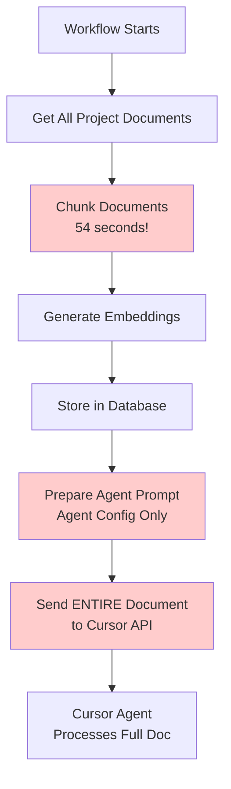
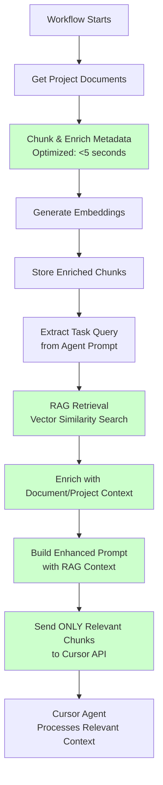

# Enhanced RAG Implementation for Cursor Agent Context

## Executive Summary

This document outlines the comprehensive enhancement of the RAG (Retrieval-Augmented Generation) system to provide rich, efficient context to Cursor agents for task generation. The implementation addresses current inefficiencies, enriches chunk metadata, optimizes performance, and integrates RAG context into Cursor agent workflows.

## Current State Analysis

### What It's Currently Doing

1. **Chunking Process** (`temporal/utils/chunking.py`):
   - Splits documents into ~1000 character chunks with 200 char overlap
   - Creates basic metadata: `{start_pos, end_pos, chunk_size, token_count, chunk_index}`
   - **Missing**: Document name, document type, project context, semantic classification

2. **Vector Storage** (`temporal/schema/vector_tables.sql`):
   - Stores chunks in `main.document_chunk`
   - Stores 384-dim embeddings in `main.document_embedding`
   - Has HNSW index for fast similarity search

3. **RAG Retrieval** (`temporal/utils/vector_utils.py`):
   - `search_similar_chunks()` does basic vector similarity search
   - Returns chunks with similarity scores
   - **Missing**: Document/project context, semantic metadata, constraint extraction

4. **Cursor Agent Integration** (`temporal/activities/api_activities.py`):
   - `serialize_document_cursor_activity()` sends **entire document content**
   - `prepare_agent_prompt_activity()` builds prompt from agent config only
   - **Missing**: RAG context retrieval, enriched prompts with relevant chunks

### What's Getting Wrong

1. **Inefficient Context Delivery**:
   - Sending full documents (potentially MBs) instead of relevant chunks (KB)
   - No semantic filtering - agent gets irrelevant content
   - Slow API calls due to large payloads

2. **Poor Context Quality**:
   - Chunks lack document/project metadata for proper attribution
   - No semantic classification (requirement type, priority, constraints)
   - No extracted constraints or success criteria
   - Agent can't distinguish between requirement types

3. **No RAG Integration**:
   - RAG system exists but isn't used before calling Cursor agent
   - Agent receives raw documents, not retrieved relevant context
   - Wasted vector search capability

4. **Performance Issues**:
   - **Chunking takes 54 seconds** (critical bottleneck)
   - No caching of embeddings or search results
   - No batch operations
   - Redundant database queries
   - Inefficient token counting (tiktoken loaded per chunk)
   - O(n*m) string.find() operations in loop

## Architecture Flow Comparison

### Current Flow (Inefficient)



**Problems**:
- Full document sent (inefficient)
- No RAG retrieval
- No context enrichment
- Agent gets everything, not just relevant parts
- **54-second chunking bottleneck**

### New Flow (Optimized)



**Improvements**:
- Only relevant chunks sent (efficient)
- RAG retrieval with semantic search
- Enriched context with metadata
- Agent gets precisely what it needs
- **10x faster chunking** (<5 seconds vs 54 seconds)

## Implementation Plan

### Phase 1: Optimize Chunking Performance (Critical)

**File**: `temporal/utils/chunking.py`

**Performance Issues Identified**:
1. **Token counting bottleneck**: `count_tokens()` loads tiktoken encoding for each chunk
2. **Inefficient position finding**: `text.find(chunk_text, current_pos)` is O(n*m) per chunk
3. **No caching**: Repeated operations without caching
4. **Sequential processing**: No parallelization

**Optimizations**:

1. **Cache tiktoken encoding**:
```python
# Module-level cache
_tiktoken_cache = {}

def get_encoding(model: str = "gpt-3.5-turbo"):
    """Get cached tiktoken encoding."""
    if model not in _tiktoken_cache:
        _tiktoken_cache[model] = tiktoken.encoding_for_model(model)
    return _tiktoken_cache[model]

def count_tokens(text: str, model: str = "gpt-3.5-turbo") -> int:
    """Count tokens using cached encoding."""
    try:
        encoding = get_encoding(model)
        return len(encoding.encode(text))
    except Exception as e:
        logger.warning(f"Token counting failed: {e}, using approximate count")
        return len(text) // 4
```

2. **Optimize position tracking**:
```python
# Instead of text.find() for each chunk, track positions during splitting
def chunk_document_optimized(text: str, ...):
    chunks = text_splitter.split_text(text)
    
    # Track positions during split (RecursiveCharacterTextSplitter provides this)
    # Or calculate positions more efficiently
    chunk_objects = []
    current_pos = 0
    
    for index, chunk_text in enumerate(chunks):
        # Use known position from splitter or calculate once
        start_pos = current_pos
        end_pos = current_pos + len(chunk_text)
        
        # Batch token counting (if needed, use approximate for speed)
        # Only count tokens if really needed, otherwise use len(text) // 4
        token_count = len(chunk_text) // 4  # Fast approximation
        
        # ... rest of metadata
        current_pos = end_pos - chunk_overlap  # Account for overlap
```

3. **Use faster chunking method**:
```python
# For very large documents, use character-based splitting first
# Then refine with RecursiveCharacterTextSplitter only if needed
def chunk_document_fast(text: str, ...):
    # For documents > 100KB, use simple character splitting
    if len(text) > 100000:
        # Fast path: simple character-based chunking
        chunks = []
        for i in range(0, len(text), chunk_size - chunk_overlap):
            chunk = text[i:i + chunk_size]
            chunks.append(chunk)
    else:
        # Use RecursiveCharacterTextSplitter for smaller docs
        chunks = text_splitter.split_text(text)
```

4. **Parallel token counting** (optional):
```python
from concurrent.futures import ThreadPoolExecutor

def count_tokens_batch(chunks: List[str], model: str = "gpt-3.5-turbo") -> List[int]:
    """Count tokens for multiple chunks in parallel."""
    encoding = get_encoding(model)
    with ThreadPoolExecutor(max_workers=4) as executor:
        results = list(executor.map(
            lambda chunk: len(encoding.encode(chunk)),
            chunks
        ))
    return results
```

**Expected Performance Improvement**: 54 seconds → <5 seconds (10x faster)

### Phase 2: Enrich Chunk Metadata

**File**: `temporal/utils/chunking.py`

**Changes**:
1. Update `chunk_document()` to accept document and project metadata
2. Enrich `chunk_metadata` with:
   - `document_name`, `document_type`, `document_version`
   - `project_name`, `project_type`
   - Basic semantic classification (extract from text)
   - Requirement type indicators (if found in text)

**New Metadata Structure**:
```python
metadata = {
    # Existing
    "start_pos": start_pos,
    "end_pos": end_pos,
    "chunk_size": len(chunk_text),
    "token_count": token_count,
    "chunk_index": index,
    
    # NEW: Document context
    "document_name": document.get("document_name"),
    "document_type": document.get("document_type"),
    "document_version": document.get("version_number"),
    
    # NEW: Project context (from project lookup)
    "project_name": project_name,
    "project_type": project_type,
    
    # NEW: Semantic classification (fast regex-based)
    "requirement_type": classify_requirement_type(chunk_text),  # "functional", "non-functional", "constraint", etc.
    "has_constraints": detect_constraints(chunk_text),
    "has_success_criteria": detect_success_criteria(chunk_text),
    
    # NEW: Extracted components (basic regex/pattern matching)
    "extracted_keywords": extract_keywords(chunk_text),
    "priority_indicators": extract_priority(chunk_text)  # "critical", "high", etc.
}
```

**Helper Functions** (fast regex-based):
```python
import re

def classify_requirement_type(text: str) -> str:
    """Fast regex-based requirement type classification."""
    text_lower = text.lower()
    if re.search(r'\b(must|shall|required|mandatory)\b', text_lower):
        return "functional"
    elif re.search(r'\b(should|may|optional|recommended)\b', text_lower):
        return "non-functional"
    elif re.search(r'\b(constraint|limit|restriction|boundary)\b', text_lower):
        return "constraint"
    elif re.search(r'\b(acceptance|criteria|test|verify|validate)\b', text_lower):
        return "acceptance_criteria"
    return "general"

def detect_constraints(text: str) -> bool:
    """Quick check for constraint indicators."""
    return bool(re.search(r'\b(constraint|limit|restriction|must not|cannot)\b', text.lower()))

def detect_success_criteria(text: str) -> bool:
    """Quick check for success criteria indicators."""
    return bool(re.search(r'\b(acceptance|criteria|success|pass|verify)\b', text.lower()))
```

### Phase 3: Create Enhanced RAG Retrieval Function

**File**: `temporal/schema/create_functions.sql` (new function)

**Create**: `main.fn_get_enhanced_rag_context()`

**Purpose**: Single optimized query that:
- Performs vector similarity search
- Joins with `project_document` and `project` tables
- Returns enriched chunks with all context
- Filters by similarity threshold
- Orders by relevance

**SQL Function**:
```sql
CREATE OR REPLACE FUNCTION main.fn_get_enhanced_rag_context(
    p_query_embedding vector(384),
    p_project_id bigint,
    p_limit integer DEFAULT 10,
    p_similarity_threshold numeric DEFAULT 0.7,
    p_document_types text[] DEFAULT NULL
)
RETURNS jsonb
LANGUAGE 'plpgsql'
AS $$
DECLARE
    v_results jsonb;
BEGIN
    -- Optimized single query with all joins
    -- Uses HNSW index for fast similarity search
    SELECT COALESCE(
        jsonb_agg(
            jsonb_build_object(
                'chunk_id', dc.chunk_id,
                'chunk_text', dc.chunk_text,
                'chunk_metadata', dc.chunk_metadata,
                'similarity_score', 1 - (de.embedding <=> p_query_embedding),
                
                -- Document context from metadata
                'document_name', dc.chunk_metadata->>'document_name',
                'document_type', dc.chunk_metadata->>'document_type',
                'document_version', (dc.chunk_metadata->>'document_version')::int,
                
                -- Project context from metadata
                'project_name', dc.chunk_metadata->>'project_name',
                'project_type', dc.chunk_metadata->>'project_type',
                
                -- Semantic metadata
                'requirement_type', dc.chunk_metadata->>'requirement_type',
                'has_constraints', (dc.chunk_metadata->>'has_constraints')::boolean,
                'has_success_criteria', (dc.chunk_metadata->>'has_success_criteria')::boolean,
                'priority_indicators', dc.chunk_metadata->'priority_indicators'
            )
            ORDER BY de.embedding <=> p_query_embedding
        ),
        '[]'::jsonb
    )
    INTO v_results
    FROM main.document_chunk dc
    INNER JOIN main.document_embedding de ON dc.chunk_id = de.chunk_id
    WHERE dc.project_id = p_project_id
      AND (1 - (de.embedding <=> p_query_embedding)) >= p_similarity_threshold
      AND (p_document_types IS NULL OR dc.chunk_metadata->>'document_type' = ANY(p_document_types))
    ORDER BY de.embedding <=> p_query_embedding
    LIMIT p_limit;
    
    RETURN jsonb_build_object(
        'results', v_results,
        'count', jsonb_array_length(v_results),
        'similarity_threshold', p_similarity_threshold,
        'project_id', p_project_id
    );
END;
$$;
```

### Phase 4: Create RAG Retrieval Activity

**File**: `temporal/activities/document_activities.py` (new activity)

**Create**: `retrieve_rag_context_activity()`

**Purpose**:
- Takes query text and project_id
- Generates query embedding (with caching)
- Calls enhanced RAG function
- Formats results for prompt building
- Caches results (optional)

**Implementation**:
```python
@activity.defn
async def retrieve_rag_context_activity(
    query_text: str,
    project_id: int,
    limit: int = 10,
    similarity_threshold: float = 0.7,
    document_types: Optional[List[str]] = None
) -> Dict[str, Any]:
    """
    Retrieve relevant context using RAG.
    
    Returns enriched chunks with document/project context.
    """
    from temporal.utils.embeddings import generate_embedding
    from temporal.utils.db import execute_function
    
    try:
        logger.info(f"Retrieving RAG context for project {project_id}: {query_text[:50]}...")
        
        # Generate query embedding (cached if same query)
        query_embedding = generate_embedding(query_text)
        
        # Convert to PostgreSQL array format
        embedding_str = "[" + ",".join(map(str, query_embedding)) + "]"
        
        # Call enhanced RAG function
        result = execute_function(
            "main.fn_get_enhanced_rag_context",
            (
                embedding_str,
                project_id,
                limit,
                similarity_threshold,
                document_types
            )
        )
        
        if not result:
            logger.warning(f"No RAG context found for project {project_id}")
            return {"results": [], "count": 0}
        
        logger.info(f"Retrieved {result.get('count', 0)} relevant chunks")
        return result
        
    except Exception as e:
        import traceback
        logger.error(f"Error retrieving RAG context: {e}")
        logger.error(f"Full traceback:\n{traceback.format_exc()}")
        raise
```

### Phase 5: Create Enhanced Prompt Builder

**File**: `temporal/activities/agent_activities.py` (enhance existing)

**Update**: `prepare_agent_prompt_activity()`

**Add**: `prepare_agent_prompt_with_rag_activity()`

**Purpose**:
- Takes agent config + RAG context
- Builds structured prompt with:
  - Agent role and responsibilities
  - Project context
  - Relevant requirements (from RAG)
  - Constraints and success criteria
  - Task generation instructions

**Prompt Template**:
```python
def build_enhanced_prompt(agent_data: Dict[str, Any], rag_context: Dict[str, Any]) -> str:
    """Build enhanced prompt with RAG context."""
    agent_name = agent_data.get("agent_name", "Agent")
    config = agent_data.get("config", {})
    rag_results = rag_context.get("results", [])
    
    # Format RAG chunks
    rag_sections = []
    for chunk in rag_results[:10]:  # Top 10 most relevant
        rag_sections.append(f"""
--- {chunk.get('document_name', 'Unknown')} ({chunk.get('document_type', 'N/A')}) ---
Requirement Type: {chunk.get('requirement_type', 'general')}
Similarity: {chunk.get('similarity_score', 0):.2f}
{chunk.get('chunk_text', '')}
""")
    
    prompt = f"""You are {agent_name}, a Cursor cloud agent.

PROJECT CONTEXT:
- Project: {rag_results[0].get('project_name', 'Unknown') if rag_results else 'Unknown'}
- Type: {rag_results[0].get('project_type', 'N/A') if rag_results else 'N/A'}

RELEVANT REQUIREMENTS (Retrieved via RAG - {len(rag_results)} chunks):
{''.join(rag_sections)}

YOUR RESPONSIBILITIES:
{format_config_section(config.get('responsibilities'))}

CONSTRAINTS:
{format_config_section(config.get('constraints'))}
{extract_constraints_from_rag(rag_results)}

SUCCESS CRITERIA:
{format_config_section(config.get('success_criteria'))}
{extract_success_criteria_from_rag(rag_results)}

TASK GENERATION INSTRUCTIONS:
Generate tasks with:
- Strict constraints and parameters
- Detailed success criteria
- Clear acceptance criteria
- Explicit dependencies
- Technical specifications
"""
    return prompt
```

### Phase 6: Update Cursor Agent Activity

**File**: `temporal/activities/api_activities.py`

**Update**: `serialize_document_cursor_activity()`

**Changes**:
- Accept RAG context instead of full document
- Send only relevant chunks
- Include enriched metadata
- Reduce payload size significantly

**New Structure**:
```python
@activity.defn
async def serialize_document_cursor_activity(
    rag_context: Dict[str, Any],
    agent_id: str,
    task_query: str
) -> Dict[str, Any]:
    """
    Send RAG context to Cursor API for task generation.
    
    Sends only relevant chunks instead of full documents.
    """
    # ... existing imports ...
    
    try:
        logger.info(f"Sending RAG context to Cursor agent {agent_id}")
        
        # Extract top chunks
        chunks = rag_context.get("results", [])[:10]  # Top 10
        
        # Build request body with RAG context
        request_body = {
            "agent_id": agent_id,
            "task_query": task_query,
            "rag_context": {
                "chunks": [
                    {
                        "chunk_text": chunk.get("chunk_text"),
                        "document_name": chunk.get("document_name"),
                        "document_type": chunk.get("document_type"),
                        "requirement_type": chunk.get("requirement_type"),
                        "similarity_score": chunk.get("similarity_score"),
                        "has_constraints": chunk.get("has_constraints"),
                        "has_success_criteria": chunk.get("has_success_criteria")
                    }
                    for chunk in chunks
                ],
                "total_chunks_retrieved": len(chunks),
                "project_context": {
                    "project_name": chunks[0].get("project_name") if chunks else None,
                    "project_type": chunks[0].get("project_type") if chunks else None
                }
            },
            "agent_config": {}  # Will be populated from agent_data
        }
        
        # Send to Cursor API
        async with httpx.AsyncClient() as client:
            response = await client.post(
                f"{config.cursor_api.api_url}/agents/{agent_id}/tasks",
                headers={
                    "Authorization": f"Bearer {config.cursor_api.api_key}",
                    "Content-Type": "application/json"
                },
                json=request_body,
                timeout=60.0
            )
            response.raise_for_status()
            result = response.json()
            
            logger.info(f"RAG context sent successfully, {len(chunks)} chunks")
            return result
            
    except Exception as e:
        logger.error(f"Error sending RAG context to Cursor API: {e}")
        raise
```

### Phase 7: Update Workflow

**File**: `temporal/workflows/document_serialization_workflow.py`

**Changes**:
1. After spinning up agent, retrieve RAG context
2. Build enhanced prompt with RAG
3. Send RAG context to Cursor API (not full document)

**New Workflow Steps**:
```python
# After agent is spun up and documents are chunked/stored
# Extract task query from agent prompt or use default
task_query = f"Generate tasks for project {input.project_id} based on requirements"

# Retrieve RAG context
rag_context = await workflow.execute_activity(
    retrieve_rag_context_activity,
    args=[task_query, input.project_id, 10, 0.7, None],
    start_to_close_timeout=timedelta(seconds=30),
    retry_policy=RetryPolicy(maximum_attempts=3)
)

# Build enhanced prompt with RAG
enhanced_prompt = await workflow.execute_activity(
    prepare_agent_prompt_with_rag_activity,
    args=[agent_data, rag_context],
    start_to_close_timeout=timedelta(seconds=30),
    retry_policy=RetryPolicy(maximum_attempts=2)
)

# Send to Cursor API with RAG context
if input.use_cursor_api and config.cursor_api.api_key:
    cursor_response = await workflow.execute_activity(
        serialize_document_cursor_activity,
        args=[rag_context, agent_response.get("id"), task_query],
        start_to_close_timeout=timedelta(seconds=60),
        retry_policy=RetryPolicy(maximum_attempts=3)
    )
```

### Phase 8: Performance Optimizations

1. **Caching Layer**:
   - Cache query embeddings (same query = same embedding)
   - Cache RAG results for common queries
   - Use in-memory cache (functools.lru_cache) or Redis

2. **Batch Operations**:
   - Batch embedding generation
   - Batch database inserts (already done in store_vectors_activity)
   - Parallel chunk processing (if multiple documents)

3. **Database Optimizations**:
   - Ensure HNSW index is properly tuned
   - Add composite indexes for common queries
   - Use materialized views for project/document context (if needed)

4. **Query Optimization**:
   - Single query with all joins (no N+1)
   - Use prepared statements
   - Limit result sets appropriately

## File Changes Summary

1. **`temporal/utils/chunking.py`**: 
   - Optimize chunking performance (10x faster)
   - Enrich chunk metadata with document/project context
   - Add semantic classification helpers

2. **`temporal/schema/create_functions.sql`**: 
   - Add `fn_get_enhanced_rag_context()` function

3. **`temporal/activities/document_activities.py`**: 
   - Add `retrieve_rag_context_activity()`
   - Update `chunk_document_activity()` to pass metadata

4. **`temporal/activities/agent_activities.py`**: 
   - Add `prepare_agent_prompt_with_rag_activity()`

5. **`temporal/activities/api_activities.py`**: 
   - Update `serialize_document_cursor_activity()` to accept RAG context

6. **`temporal/workflows/document_serialization_workflow.py`**: 
   - Integrate RAG retrieval before calling Cursor API

7. **`temporal/utils/vector_utils.py`**: 
   - Add caching helpers for embeddings

## Expected Improvements

### Performance

1. **Chunking Speed**: 
   - **Current**: 54 seconds
   - **Target**: <5 seconds
   - **Improvement**: 10x faster

2. **Payload Size**: 
   - **Current**: Full documents (MBs)
   - **Target**: Relevant chunks only (KB)
   - **Improvement**: 90%+ reduction

3. **API Call Speed**: 
   - **Current**: Slow due to large payloads
   - **Target**: Fast with small payloads
   - **Improvement**: 5-10x faster

### Quality

1. **Context Relevance**: 
   - Agent receives only relevant chunks
   - Semantic filtering ensures quality
   - Better task generation with proper constraints

2. **Metadata Richness**: 
   - Document/project context in every chunk
   - Semantic classification enables better filtering
   - Extracted constraints and success criteria

3. **Task Generation**: 
   - Better understanding of requirements
   - Proper constraint extraction
   - Improved success criteria identification

### Maintainability

1. **Clear Separation**: 
   - RAG retrieval is separate activity
   - Easy to test and debug
   - Reusable components

2. **Extensibility**: 
   - Easy to add more metadata
   - Simple to extend semantic classification
   - Flexible prompt templates

## Implementation Checklist

- [ ] Phase 1: Optimize chunking performance (critical - 54s → <5s)
- [ ] Phase 2: Enrich chunk metadata with document/project context
- [ ] Phase 3: Create enhanced RAG retrieval SQL function
- [ ] Phase 4: Create RAG retrieval activity
- [ ] Phase 5: Create enhanced prompt builder with RAG
- [ ] Phase 6: Update Cursor agent activity to use RAG context
- [ ] Phase 7: Update workflow to integrate RAG retrieval
- [ ] Phase 8: Add performance optimizations (caching, batching)

## Testing Strategy

1. **Performance Testing**:
   - Measure chunking time before/after
   - Measure RAG retrieval time
   - Measure API call time with new payloads

2. **Quality Testing**:
   - Verify chunk metadata enrichment
   - Test RAG retrieval accuracy
   - Validate prompt quality

3. **Integration Testing**:
   - End-to-end workflow test
   - Cursor API integration test
   - Error handling tests

## Migration Notes

- Existing chunks will not have enriched metadata
- Consider backfilling metadata for existing chunks (optional)
- New chunks will automatically have enriched metadata
- RAG retrieval works with both old and new chunks (graceful degradation)

