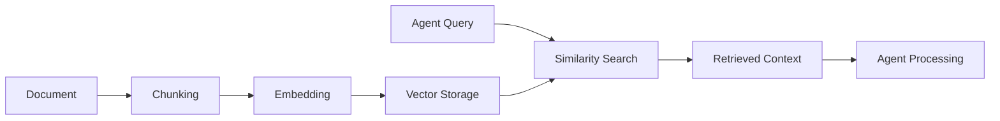

# RAG Overview

## What is RAG?

**Retrieval Augmented Generation (RAG)** is a technique that enhances Large Language Model (LLM) capabilities by providing relevant context from a knowledge base. Instead of relying solely on the LLM's training data, RAG retrieves relevant information from your documents and includes it in the prompt.

## Why RAG for Document Serialization?

In this system, RAG serves multiple purposes:

1. **Context for Agents**: When agents need to understand project requirements, they can retrieve relevant document chunks instead of processing entire documents.

2. **Efficient Processing**: Large documents are split into manageable chunks, making it easier to find and use specific information.

3. **Semantic Search**: Vector embeddings enable finding documents by meaning, not just keywords.

4. **Scalability**: As projects grow, agents can quickly find relevant context without processing all documents every time.

## How RAG Works in This System

### The RAG Pipeline

1. **Document Ingestion**: Documents are uploaded to the system
2. **Chunking**: Documents are split into semantic chunks (see [Chunking Guide](01_CHUNKING_GUIDE.md))
3. **Embedding**: Each chunk is converted to a vector (see [Embeddings Guide](02_EMBEDDINGS_GUIDE.md))
4. **Storage**: Vectors are stored in PostgreSQL with pgvector (see [Vector Storage Guide](03_VECTOR_STORAGE_GUIDE.md))
5. **Retrieval**: When needed, similar chunks are found using vector similarity (see [Similarity Search Guide](04_SIMILARITY_SEARCH_GUIDE.md))
6. **Context Assembly**: Retrieved chunks are assembled into context for agents

## Architecture Integration

RAG is integrated into the document serialization workflow:

- **During Serialization**: Documents are chunked and embedded as part of the serialization process
- **During Task Creation**: Agents can query for relevant chunks to understand requirements
- **During Development**: Agents retrieve context to make informed decisions

## Key Components

- **Chunking**: `temporal/utils/chunking.py` - Semantic text splitting
- **Embeddings**: `temporal/utils/embeddings.py` - OpenAI embedding generation
- **Vector Storage**: `temporal/schema/vector_tables.sql` - Database schema
- **Similarity Search**: `temporal/utils/vector_utils.py` - Vector search functions

## Next Steps

- Learn about [Document Chunking](01_CHUNKING_GUIDE.md)
- Understand [Embedding Generation](02_EMBEDDINGS_GUIDE.md)
- Explore [Vector Storage](03_VECTOR_STORAGE_GUIDE.md)
- Master [Similarity Search](04_SIMILARITY_SEARCH_GUIDE.md)
- See the [Complete Workflow](05_RAG_WORKFLOW_GUIDE.md)

